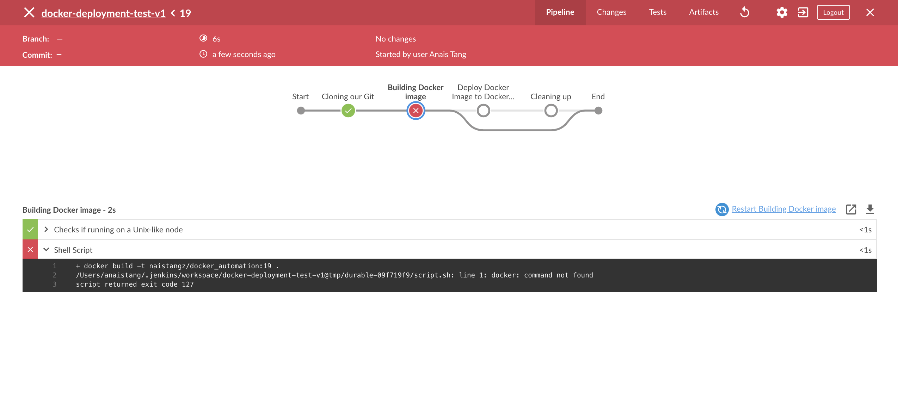
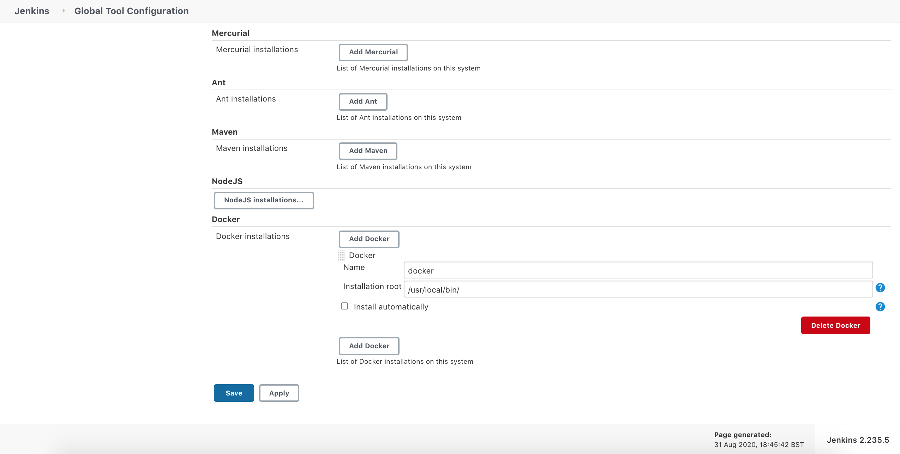
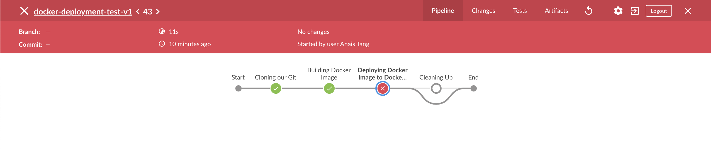
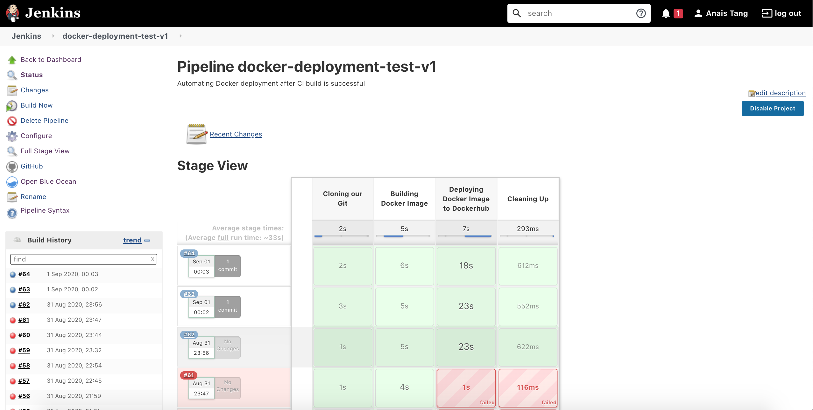
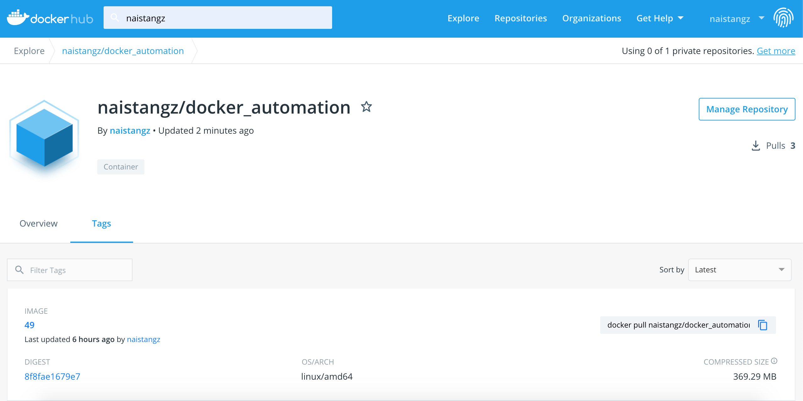

# Automating Docker container deployment with Jenkins :whale: 

## TL;DR
**WHAT**: Use Docker Plugins to connect Jenkins to Docker and automate entire containerisation process 

**HOW**: Install Jenkins, installing and configuring Docker plugins, create CI and CD Jenkins builds, create Docker repository

---

**Contents**
1. [Part I: Installing Java8 and Jenkins](#part-i-installing-java8-and-jenkins)
2. [Part II: Configuring Jenkins and managing Docker plugins](#part-iii-configuring-jenkins)
3. [Part III: Setting a CI job](#setting-up-ci-build-on-jenkins)
4. [Part IV: Setting up a CD job and automatically creating a Docker image](#part-iv-setting-up-cd-build-on-jenkins-with-dockerfile)
5. [Part V: Troubleshooting](#part-v-troubleshooting)
6. [Part VI: Testing Full Automation](#part-vi-testing-full-automation)
---
## Part I: Installing Java8 :coffee: and Jenkins :woman_cook:

> Full installation instructions [here](https://www.macminivault.com/installing-jenkins-on-macos/)

1. Install Jenkins on MacOS using Homebrew package manager :beers: 
> If homebrew already installed (run in Terminal `brew -v` to check), skip to the next step 
```ba
/usr/bin/ruby -e /usr/bin/ruby -e "$(curl -fsSL https://raw.githubusercontent.com/Homebrew/install/master/install)"
```

2. Check if Homebrew requires any recommendations:
```bash
brew doctor
```

3. Before installing Jenkins, we need to install Java8
```bash
brew cask install java8
```
**Troubleshooting error**:
```bash
Cask 'java8' is unavailable: No Cask with this name exists.
java --version
java 14.0.1 2020-04-14
Java(TM) SE Runtime Environment (build 14.0.1+7)
Java HotSpot(TM) 64-Bit Server VM (build 14.0.1+7, mixed mode, sharing)
``` 

Jenkins requires Java8. Click [here](http://www.oracle.com/technetwork/java/javase/downloads/jdk8-downloads-2133151.html) to install.

Check all installed java version
```bash
/usr/libexec/java_home -V
```
**which should return**
```bash
Matching Java Virtual Machines (2):
    14.0.1, x86_64:	"Java SE 14.0.1"	/Library/Java/JavaVirtualMachines/jdk-14.0.1.jdk/Contents/Home
    1.8.0_251, x86_64:	"Java SE 8"	/Library/Java/JavaVirtualMachines/jdk1.8.0_251.jdk/Contents/Home
```

Pick `1.8.0_251, x86_64` to set as the default then:
```bash
export JAVA_HOME=`/usr/libexec/java_home -v 1.8.0_251, x86_64`
```

When you run java -version you will see:
```bash
java version "1.8.0_251"
```

4. To make the Jenkins web interface accessible from anywhere, not just local machine, open up the config file:
```bash
sudo nano /usr/local/opt/jenkins-lts/homebrew.mxcl.jenkins-lts.plist
```

5. Find this line:
```bash
<string>--httpListenAddress=127.0.0.1</string>
```

6. Change it to:
```bash
<string>--httpListenAddress=0.0.0.0</string>
```
To exit out of nano, press `Ctrl+X`, hit `Y` to save Changes, hit `Enter`

7. Start or restart Jenkins
```bash
brew services start jenkins-lts
brew services restart jenkins-lts
```

8. Open the browser and type in the following:
```bash
http://localhost:8080/
```

9. To check whether jenkins is running:
```bash
brew services list
```

---
## Part II: Configuring Jenkins :woman_cook:
1. Navigate to Manage Jenkins > Manage Plugins > Available > Install **all** Docker plugins, `docker-build-step`, `Docker Compose Build Step`, `Docker build plugins` and `Github`

**List of plugins used:**
```bash
Blue Ocean
Credentials Plugin
Docker Plugin
CloudBees Docker Hub/Registry Notification
CloudBees Docker Build and Publish
Email Extension
Github Plugin
NodeJS Plugin
Oracle Java SE Development Kit Installer Plugin
Pipeline Plugin
Timestamper
```

**Tip:** Install `Blue Ocean` plugin for better UI 

---

## Part III: Setting up CI build on Jenkins :woman_cook:
1. Create a freestyle job on Jenkins and call it `Docker_Pipeline_Integration_Test` with the following configurations:
    - **General** -> `Discard Old Builds` -> `Max # of builds to keep` -> 3
    - **Github Project URL** -> Insert URL for Github Repository
    - **Source Code Management** -> `Git` ->  Insert `Repository URL` and `Credentials` (To learn how to add credentials click [here](https://sharadchhetri.com/how-to-setup-jenkins-credentials-for-git-repo-access/)) -> `Branches to build` -> `Branch Specifier` -> `*/dev*`
    - **Build Triggers** -> `GitHub hook trigger for GITScm polling`
    - **Build Environment** -> `Add Timestamps` -> `Provide Node & npm bin/folder to PATH` -> Choose default NodeJs Installation (go to step 3 if NodeJS plugin requires activation) -> npmrc file ` - use system default - ` - Cache location `Default`
    - **Build** -> `Execute Shell` -> Go to Step 5 
    - **Post-build Actions** -> `Push Only if Build Succeeds` -> `Merge Results` -> `Branches` -> Branch to push: `master` -> Target remote name: `origin`
    -  Click `Apply` and `Save`

> **Note**: Webhooks only work with a public IP. You will need to forward your local port [http://localhost:8080/](http://localhost:8080/) to the Internet/public using an SSH server like [Serveo](https://medium.com/automationmaster/how-to-forward-my-local-port-to-public-using-serveo-4979f352a3bf), Ngrok or [SocketXP](https://www.socketxp.com/download). 
---
> To set up Github Webhooks, Jenkins, and Ngrok for Local Development click [here](https://medium.com/@developerwakeling/setting-up-github-webhooks-jenkins-and-ngrok-for-local-development-f4b2c1ab5b6)
---
**Commands to forward local port to public IP with** `SocketXP`:
```bash
sudo su
sudo curl -O https://portal.socketxp.com/download/darwin/socketxp && chmod 777 socketxp && sudo mv socketxp /usr/local/bin
socketxp login "authentication_token_goes_here"
socketxp connect http://localhost:8080
Connected.
Public URL -> https://naistangz-z012h3op.socketxp.com
```
---
2. On Github, navigate to your [repository](https://github.com/naistangz/Docker_Jenkins_Pipeline/tree/development) -> Go to `Settings` -> `Webhooks` -> in Payload URL, enter Jenkins URL e.g:
```bash
http://naistangz-z012h3op.socketxp.com/github-webhook/
```
-> Enable `SSL verification` -> `Update webhook` -> `Redeliver`

3. Go back to Jenkins and make sure `nodejs` plugin is installed
4. To activate `nodejs` plugin, go to `Manage Jenkins` > `System Configuration` > `Global Tool Configuration` > `NodeJS` > `Add NodeJS` > Give it a name e.g. `Node` > Save and Apply
5. Execute shell
```bash
npm install 
npm test
```
6. Once saved, make changes on your IDE on a new branch and push to Github -> Jenkins will listen to incoming `POST` requests to the Payload URL used on Github and automatically merge changes from the new branch to the master branch if the tests pass. 
7. Go to console output to check if the build was successful (indicated by the blue circle :large_blue_circle:)

---
## Part IV: Setting up CD build on Jenkins with Dockerfile 	:whale:
Once our CI build is successful, create another build on Jenkins which will listen to the CI build which we named `Docker_Pipeline_Integration_Test` and automatically build a Docker image if it successfully passed the tests and merges the code to the master branch. 
1. Make sure `docker pipeline plugin` is installed
2. Create a [Dockerhub](https://hub.docker.com/) account
3. Once logged in, click on `Create` -> `Create Repository` -> Type in a name for your Docker repository e.g `naistangz/docker_automation`
4. After the Docker repository has been created, go back to Jenkins and navigate to `Credentials` -> `System` -> `Global Credentials` -> `Add Credentials`
5. Enter your Dockerhub credentials e.g
    - **Kind** -> `Username with password`
    - **Scope** -> Global(Jenkins, nodes, items, all child items, etc)
    - **Username** -> Dockerhub Username
    - **Password** -> Dockerhub Password
    - **ID** -> dockerhub
    - **Description** -> Dockerhub Credentials

6. Go back to Jenkins home page and click `New Item`, select `Pipeline` and name it `docker-deployment-test-v1` and provide it with the following configurations:
    - **General** -> Github project -> Insert Project URL
    - **Build Triggers** -> Select `Build after other projects are built` -> Projects to Watch (select the CI build created in [Part III](#part-iii-setting-up-ci-build-on-jenkins)): `Docker_Pipeline_Integration_Test` -> Trigger only if build is stable
    - **Pipeline** -> Add the following script (scripts are based on the Groovy programming language):
```bash
pipeline {
  environment {
    registry = "naistangz/docker_automation"
    registryCredential = 'dockerhub'
    dockerImage = ''
  }
  agent any
  stages {
    stage('Cloning Git') {
      steps {
        git 'https://github.com/naistangz/Docker_Jenkins_Pipeline'
      }
    }
    stage('Building image') {
      steps{
        script {
          dockerImage = docker.build registry + ":$BUILD_NUMBER"
        }
      }
    }
    stage('Deploy Image') {
      steps{
         script {
            docker.withRegistry( '', registryCredential ) {
            dockerImage.push()
          }
        }
      }
    }
    stage('Remove Unused docker image') {
      steps{
        sh "docker rmi $registry:$BUILD_NUMBER"
      }
    }
  }
}
```
---
**Pipeline explanation**:\
In this pipeline, we have 2 environment variables to change the registry and credentials:
```bash
environment {
    registry = "naistangz/docker_automation"
    registryCredential = 'dockerhub'
    dockerImage = ''
  }
```
Jenkins will clone a git repository that has a Dockerfile inside
```bash
stage('Cloning Git') {
      steps {
        git 'https://github.com/naistangz/Docker_Jenkins_Pipeline'
      }
    }
```
In the `Docker_Jenkins_Pipeline` repository on `Github`, the Dockerfile contains the following configurations:
```yaml
# Selecting the base image to build our own customised node.js application microservice
FROM node 

# Working directory inside the container
WORKDIR /usr/src/app

# Copying dependencies
COPY package*.json ./

# Installing node package manager
RUN npm install

# Copying everything from current location to default location inside the container
COPY . .

# Expose the port
EXPOSE 3000

# Starting the app with CMD - 
CMD ["node", "app.js"]
```
The following stage will build the image based on the Dockerfile detected in Git repository 
```bash
stage('Building image') {
      steps{
        script {
          dockerImage = docker.build registry + ":$BUILD_NUMBER"
        }
      }
    }
```
Once the Docker image has been created, it will be pushed to Dockerhub
```bash
stage('Deploy Image') {
      steps{
         script {
            docker.withRegistry( '', registryCredential ) {
            dockerImage.push()
          }
        }
      }
    }
```
Finally, we will remove the previously built image on the local server so that we do not accumulate all the images in our Docker localhost 
```bash
stage('Remove Unused docker image') {
      steps{
        sh "docker rmi $registry:$BUILD_NUMBER"
      }
    }
```

---

7. Click on `Save` and `Apply`
8. To test if the build was successful, make a change on the development branch
---

## Part V: Troubleshooting
**1. Docker: Command Not found**  

> - Fixed by explicitly adding the file path of Docker as Jenkins pipeline will not automatically determine `Docker` file:
```bash
pipeline {

    environment {
        PATH = "$PATH:<folder_where_docker_is>"
    }
}
```
For example if `docker` is located in:
```bash
$ which docker
$ /usr/local/bin/docker
```
Jenkins `Pipeline` script should be modified to:
```bash
pipeline {

    environment {
        PATH = "$PATH:/usr/local/bin"
    }
}
```
**OR**

Set installation root by navigating to `Jenkins Homepage` -> `Global Tool Configuration` -> `Docker` -> Name: `docker` -> Installation root:`/usr/local/bin/`


---
**2. Java.io.IOException:error=2, No such file or directory**
```bash
java.io.IOException: error=2, No such file or directory
	at java.base/java.lang.ProcessImpl.forkAndExec(Native Method)
	at java.base/java.lang.ProcessImpl.<init>(ProcessImpl.java:340)
	at java.base/java.lang.ProcessImpl.start(ProcessImpl.java:271)
	at java.base/java.lang.ProcessBuilder.start(ProcessBuilder.java:1107)
Caused: java.io.IOException: Cannot run program "docker": error=2, No such file or directory
	at java.base/java.lang.ProcessBuilder.start(ProcessBuilder.java:1128)
	at java.base/java.lang.ProcessBuilder.start(ProcessBuilder.java:1071)
	at hudson.Proc$LocalProc.<init>(Proc.java:252)
	at hudson.Proc$LocalProc.<init>(Proc.java:221)
	at hudson.Launcher$LocalLauncher.launch(Launcher.java:936)
	at hudson.Launcher$ProcStarter.start(Launcher.java:454)
	at hudson.Launcher$ProcStarter.join(Launcher.java:465)
	at org.jenkinsci.plugins.docker.commons.impl.RegistryKeyMaterialFactory.materialize(RegistryKeyMaterialFactory.java:101)
	at org.jenkinsci.plugins.docker.workflow.AbstractEndpointStepExecution2.doStart(AbstractEndpointStepExecution2.java:53)
	at org.jenkinsci.plugins.workflow.steps.GeneralNonBlockingStepExecution.lambda$run$0(GeneralNonBlockingStepExecution.java:77)
	at java.base/java.util.concurrent.Executors$RunnableAdapter.call(Executors.java:515)
	at java.base/java.util.concurrent.FutureTask.run(FutureTask.java:264)
	at java.base/java.util.concurrent.ThreadPoolExecutor.runWorker(ThreadPoolExecutor.java:1128)
	at java.base/java.util.concurrent.ThreadPoolExecutor$Worker.run(ThreadPoolExecutor.java:628)
	at java.base/java.lang.Thread.run(Thread.java:834)
Finished: FAILURE
```
> - [Fixed](https://stackoverflow.com/questions/50333325/jenkins-cannot-run-program-docker-error-2-no-such-file-or-directory) by making sure Docker is available to the PATH variable Jenkins is using.
> - Since I am using Jenkins on my local host machine and I installed it through Homebrew I navigated and edited the following file in my terminal:
```bash
/usr/local/opt/jenkins-lts/homebrew.mxcl.jenkins-lts.plist
```
and made the following changes:
```bash
<?xml version="1.0" encoding="UTF-8"?>
<!DOCTYPE plist PUBLIC "-//Apple//DTD PLIST 1.0//EN" "http://www.apple.com/DTDs/PropertyList-1.0.dtd">
<plist version="1.0">
  <dict>
    <key>Label</key>
    <string>homebrew.mxcl.jenkins-lts</string>
    <key>ProgramArguments</key>
    <array>
      <string>/usr/libexec/java_home</string>
      <string>-v</string>
      <string>1.8</string>
      <string>--exec</string>
      <string>java</string>
      <string>-Dmail.smtp.starttls.enable=true</string>
      <string>-jar</string>
      <string>/usr/local/opt/jenkins-lts/libexec/jenkins.war</string>
      <string>--httpListenAddress=127.0.0.1</string>
      <string>--httpPort=8080</string>
    </array>
    <key>EnvironmentVariables</key>
    <dict>
      <key>PATH</key>
      <string>/usr/local/bin:/usr/bin:/bin:/usr/sbin:/sbin</string>
    </dict>
    <key>RunAtLoad</key>
    <true/>
  </dict>
</plist>
```
The important part being:
```bash
<key>EnvironmentVariables</key>
    <dict>
      <key>PATH</key>
      <string>/usr/local/bin:/usr/bin:/bin:/usr/sbin:/sbin</string>
    </dict>
```



---

**3. :warning: Unable to docker login through CLI (Command Line Interface)**
```bash
Using the existing docker config file.Removing blacklisted property: authsRemoving blacklisted property: credsStore$ docker login -u naistangz -p ******** https://registry-1.docker.io/v2/
WARNING! Using --password via the CLI is insecure. Use --password-stdin.
Error response from daemon: Get https://registry-1.docker.io/v2/: unauthorized: incorrect username or password
```
Typing in `curl https://registry-1.docker.io/v2/` in terminal returns:
```bash
{"errors":[{"code":"UNAUTHORIZED","message":"authentication required","detail":null}]}
```

Edit `/Users/anaistang/.docker/config.json` file 
```bash
{
        "auths": {},
        "HttpHeaders": {
                "User-Agent": "Docker-Client/19.03.8 (darwin)"
        },
        "credsStore": "",
        "experimental": "enabled",
        "stackOrchestrator": "swarm"
}
This way docker will store credentials in `config.json`
```

Success! Open stage view in `Blue Ocean`


**OR** Click on `stage views` to visualise the Pipeline and logs




The image should automatically appear on Dockerhub


---

## Part VI: Testing full automation
```bash
1. git checkout development 
2. nano views/index.ejs
3. Make a change on the embedded javascript (ejs) template
4. git add .
5. git commit -m 'automation testing'
5. git push
```# Docker_Jenkins_Pipeline
